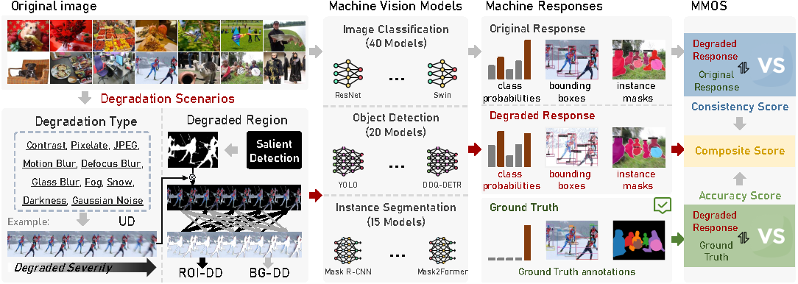

<div align="center">

# MIQD-2.5M

[](https://github.com/XiaoqiWang/MIQD-2.5M)
[](https://github.com/XiaoqiWang/MIQA)
[](https://arxiv.org/abs/2508.19850)
[](https://huggingface.co/)
[](https://github.com/XiaoqiWang/MIQD-2.5M)
[](LICENSE)

</div>

---

<div align="center">


<p align="center" style="color:gray; margin-bottom:0.01em; font-size:1.2em">
This repository provides the database for the paper:
</p>
<h3 align="center" style="margin-top:0.01em;">
Image Quality Assessment for Machines: Paradigm, Large-scale Database, and Models
</h3>

*Xiaoqi Wang, Yun Zhang, Weisi Lin*  

[📖 Paper](https://arxiv.org/abs/2508.19850) | [🗃️ Dataset](https://github.com/XiaoqiWang/MIQD-2.5M) | [👨‍💻 Code](https://github.com/XiaoqiWang/MIQA) | [🤗 HuggingFace](https://huggingface.co/)  

</div>


---

## 📋 Database Construction Pipeline
<div align="center">
  
</div>

## ✨ Database Highlights

- **Massive scale**: 2.5 million degraded images generated from 10,000 carefully selected original images across 1,000+ object categories.
- **Region-aware degradation**: Introduces spatial degradation patterns (uniform, ROI-dominated, and background-dominated) to simulate real-world quality variations.
- **Comprehensive degradation**: 10 distortion types across 4 categories (digital, blur, environmental, noise) with 5 severity levels each.
- **Multi-task evaluation**: Covering three representative vision tasks (image classification, object detection, and instance segmentation) with a total of 75 diverse models.
- **Quality labels (MMOS)**: Machine vision quality is evaluated by consistency (prediction stability), accuracy (task performance), and their integrated composite metric.
---

### 📝 Database Description 
<details open>
<summary>📊 MIQD-2.5M Characteristics Summary</summary>

| Task | Original Images | Source | Degradation Types | Severity Levels | Region Types | Object Categories | Degraded Images | Resolution Range |
|------|-----------------|--------|-------------------|-----------------|--------------|-------------------|-----------------|------------------|
| Image Classification | 5,000 | ImageNet | 10 | 5 | 3 | 1,000 | 1,250,000 | 262×415 ~ 4288×2848 |
| Object Detection & Instance Segmentation | 5,000 | MS COCO | 10 | 5 | 3 | 80 | 1,250,000 | 200×145 ~ 640×640 |
| **Total** | **10,000** | **-** | **10** | **5** | **3** | **≥1,000** | **2,500,000** | **200×145 ~ 4288×2848** |

</details>

<details>
<summary>📊 Summary of Degradation Regions, Distortion Intensity Levels, and Categories </summary>

Each pair (x, y) represents ROI distortion intensity `x` and background distortion intensity `y`.
<table>
  <thead>
    <tr>
      <th>Degraded Region</th>
      <th>Degraded Severity</th>
      <th>Degraded Region</th>
      <th>Degraded Severity</th>
      <th>Degraded Region</th>
      <th>Degraded Severity</th>
      <th>Degraded Category</th>
      <th>Degraded Name</th>
    </tr>
  </thead>
  <tbody>
    <tr>
      <td rowspan="10"><b>Uniform Distortion (UD)</b></td>
      <td>(1, 1)</td>
      <td rowspan="10"><b>ROI-Dominated Distortion (ROI-DD)</b></td>
      <td>(2, 1)</td>
      <td rowspan="10"><b>Background-Dominated Distortion (BG-DD)</b></td>
      <td>(1, 2)</td>
      <td rowspan="3">Digital</td>
      <td>Contrast</td>
    </tr>
    <tr>
      <td></td>
      <td>(3, 1)</td>
      <td>(1, 3)</td>
      <td>Pixelate</td>
    </tr>
    <tr>
      <td>(2, 2)</td>
      <td>(4, 1)</td>
      <td>(1, 4)</td>
      <td>JPEG</td>
    </tr>
    <tr>
      <td></td>
      <td>(5, 1)</td>
      <td>(1, 5)</td>
      <td rowspan="3">Blur</td>
      <td>Motion blur</td>
    </tr>
    <tr>
      <td>(3, 3)</td>
      <td>(3, 2)</td>
      <td>(2, 3)</td>
      <td>Defocus blur</td>
    </tr>
    <tr>
      <td></td>
      <td>(4, 2)</td>
      <td>(2, 4)</td>
      <td>Glass blur</td>
    </tr>
    <tr>
      <td>(4, 4)</td>
      <td>(5, 2)</td>
      <td>(2, 5)</td>
      <td rowspan="3">Environmental Conditions</td>
      <td>Fog</td>
    </tr>
    <tr>
      <td></td>
      <td>(4, 3)</td>
      <td>(3, 4)</td>
      <td>Snow</td>
    </tr>
    <tr>
      <td>(5, 5)</td>
      <td>(5, 3)</td>
      <td>(3, 5)</td>
      <td>Darkness</td>
    </tr>
    <tr>
      <td></td>
      <td>(5, 4)</td>
      <td>(4, 5)</td>
      <td>Noise</td>
      <td>Gaussian noise</td>
    </tr>
  </tbody>
</table>

</details>

---

## 📥 Download Links
### 🔗 Download Links

|                    **Database**                     |               **Vision Task**                |                                      **Images**                                      |                                     **Labels**                                      |                  **Additional Info**                  |                  **Original Images**                   |                    **Full Database**                     |       **Size**        |
|:---------------------------------------------------:|:--------------------------------------------:|:------------------------------------------------------------------------------------:|:-----------------------------------------------------------------------------------:|:-----------------------------------------------------:|:------------------------------------------------------:|:--------------------------------------------------------:|:---------------------:|
|                  MIQD-2.5M Subset1                  |             image classification             |                [Quark](https://pan.quark.cn/s/7a73d291916c?pwd=YbkN)                 |                [Quark](https://pan.quark.cn/s/a25974888815?pwd=fhFA)                | [Quark](https://pan.quark.cn/s/ee5ebe92ef60?pwd=LnQA) | [Quark](https://pan.quark.cn/s/c80d65234c08?pwd=vKrS)  |  [Quark](https://pan.quark.cn/s/6bb6858b82c6?pwd=pMrw)   |        ~458 GB        |
|                  MIQD-2.5M Subset2                  |               object detection               |                [Quark](https://pan.quark.cn/s/10fa155b893f?pwd=Gq3X)                 |                [Quark](https://pan.quark.cn/s/dbea86b84464?pwd=12Xz)                | [Quark](https://pan.quark.cn/s/07362eb4edd7?pwd=dKy4) | [Quark](https://pan.quark.cn/s/9526158abaf4?pwd=A9Ud)  |  [Quark](https://pan.quark.cn/s/9de83a862deb?pwd=4n7U)   |        ~480 GB        |
|                  MIQD-2.5M Subset3                  |            instance segmentation             |                                   Same as Subset2                                    |                [Quark](https://pan.quark.cn/s/d6290cd0ef1c?pwd=JTfz)                |                           Same as Subset2                          |                           Same as Subset2                            |                            -                             | ~227.3MB (Label only) |
| <span style="color:red">**MIQD-2.5M (Full)**</span> | <span style="color:red">**All Tasks**</span> | -|        -| -| -|                        [Quark](https://pan.quark.cn/s/c1d48e711db5?pwd=1PUW) |                     **~916.2GB**                      |

**📌 Notes:**  
You can **download either individual subsets** (e.g., classification, detection, segmentation) or **the complete **MIQD-2.5M** database**.
The MIQD-2.5M Subset3 (instance segmentation) shares its image data with Subset2 (object detection), as both are derived from the MS COCO dataset.
### 📂 Dataset Structure
<details>
<summary>Database Structure</summary>

```
MIQD_2.5M/
├── miqa_cls/                        # Image classification subset
│   ├── images/                      
│   │   ├── ILSVRC2012_val_00000012/
│   │   │   └──ILSVRC2012_val_00000012_contrast_1.png
│   │   │   └──ILSVRC2012_val_00000012_contrast_2.png
│   │   │   └──...
│   │   ├── ILSVRC2012_val_00000023/
│   │   └── ...
│   ├── labels/                     
│   │   └── ILSVRC2012_val_00000012_mmos.csv
│   │   └── ILSVRC2012_val_00000023_mmos.csv    
│   │   └── ...
│   ├──src_images/ 
│   │    └── ILSVRC2012_val_00000012.JPEG
│   │    └── ...               
│   └── additional_info/ 
│
├── miqa_det/                        # Object detection subset
│   ├── images/                      
│   │   ├── 000000000139/
│   │   │   └── 000000000139_contrast_1.png
│   │   │   └── ...
│   │   ├── 000000000285/
│   │   └── ...
│   ├── labels/                     
│   │   └── 000000000139_accuracy.csv
│   │   └── 000000000139_consistency.csv    
│   │   └── ...
│   ├──src_images/ 
│   │    └── 000000000139.jpg
│   │    └── ...               
│   └── additional_info/         
│
├── miqa_ins/                        # Instance segmentation subset
 ......
│
└── README.md

```

</details>

### 🧪 Database Examples

<details>

<summary>Database Examples</summary>

<div align="center">
  
</div>
Sample illustration showcasing the corresponding  
<span style="color:#9ACD32; font-weight:bold">PSNR</span>,  
<span style="color:#556B2F; font-weight:bold">SSIM</span>, and  
<span style="color:#006400; font-weight:bold">LPIPS</span> values,
along with the predicted <span style="color:#6495ED; font-weight:bold"> Consistency</span>,  
<span style="color:#000080; font-weight:bold">Accuracy</span>, and <span style="color:#191970; font-weight:bold">Composite</span> scores, and their respective ground-truth<span style="color:#FF7F50; font-weight:bold"> Consistency</span>, <span style="color:#FF4500; font-weight:bold">Accuracy</span>, and<span style="color:#8B4513; font-weight:bold"> Composite</span> scores.  
Panels (a)–(d), (e)–(g), and (h)–(j) present example images along with MIQA-related scores for image classification under UD, object detection under ROI-DD, and instance segmentation under BG-DD, respectively. Numbers in parentheses indicate distortion severity in ROI and background regions.
Note: Lower LPIPS indicates higher perceptual quality, whereas higher values are preferred for other metrics.

</details>

---

## 📚 Citation

If you find our work useful in your research, please consider citing:

```bibtex
@article{wang2025miqa,
  title={Image Quality Assessment for Machines: Paradigm, Large-scale Database, and Models},
  author={Wang, Xiaoqi and Zhang, Yun and Lin, Weisi},
  journal={arXiv preprint arXiv:2508.19850},
  year={2025}
}
```

---

## 📮 Contact

For questions and feedback:

- **📧 Email**: wangxq79@mail2.sysu.edu.cn; xqwang.research@outlook.com

---

## 📄 License and Terms of Use

<details>
<summary>License and Terms of Use</summary>

**License:** This project is released under the MIT License.

**Academic Use Only:** Non-commercial research and educational purposes only.

**Citation Required:** Users must cite the associated paper in all publications.

**Source Attribution:** All images derive from publicly available datasets (ImageNet, MS COCO). Original copyrights remain with respective owners.

**User Responsibility:** Comply with applicable laws and ethical standards. No harmful or discriminatory use.

</details>
 
---

<div align="right">
  <sub>Built with ❤️ by [Xiaoqi Wang]</sub>
</div>
